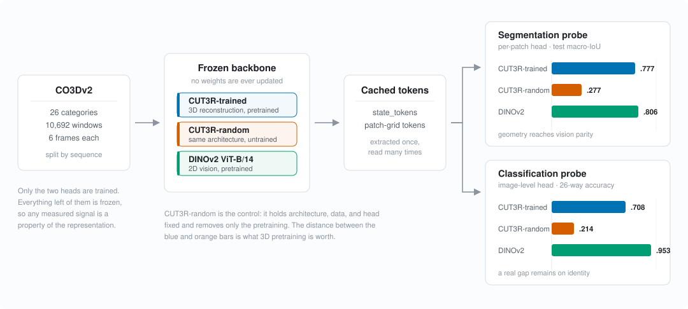

# What does CUT3R see?

**Semantic probing of a frozen 3D-reconstruction model.**
Final project, Modern Computer Vision, Technion.

[CUT3R](https://arxiv.org/abs/2501.12387) is trained to reconstruct 3D geometry
from a stream of 2D images. It is never shown a semantic label. This project
asks whether its internal representation nevertheless encodes semantics — and
if so, how much, and how accessible it is.

We freeze the backbone, cache its tokens once, and train only small probe
heads on top. Anything a probe can read is therefore a property of the
representation, not of the probe.



## What we found

On 26 CO3D categories, held out by sequence, against a random-weight control of
the same architecture and a dedicated 2D vision model:

| | Foreground segmentation<br>(test macro-IoU) | Object identity<br>(26-way test accuracy) |
|---|---|---|
| **CUT3R-trained** | **0.777** | **0.708** |
| CUT3R-random | 0.277 | 0.214 |
| DINOv2 ViT-B/14 | 0.806 | 0.953 |
| *chance* | — | *0.038* |

**Geometric pretraining produces semantics as a by-product.** CUT3R-trained
beats its own randomly-initialised twin by +0.50 on segmentation IoU and +0.49
on classification accuracy (paired 95% CI [0.443, 0.543]). The architecture and
the head explain none of that; the pretraining explains all of it.

**On localisation it reaches vision-model parity.** 0.777 against DINOv2's
0.806 — the paired bootstrap interval on that difference contains zero. On
recall it is ahead (0.94 vs 0.89); it over-predicts foreground slightly
(precision 0.79 vs 0.89).

**On identity a real gap remains.** DINOv2's 0.953 is +0.245 [0.203, 0.288]
above CUT3R-trained. Geometry gets you a long way past chance, not all the way
to a model trained for the task.

**The signal is close to linearly available.** Replacing the MLP head with a
plain linear layer costs CUT3R-trained 0.037 IoU and *nothing* in
classification accuracy (−0.024 [−0.051, 0.002], interval spanning zero), while
it costs the random control 42% of its score. A representation that needs no
nonlinear readout is one whose semantic content is already largely disentangled.

Every interval above resamples complete CO3D **sequences**, not windows —
four views of one physical object are not four independent observations.

Full results, with the configuration behind each run:
[reports/segmentation](reports/segmentation/README.md) ·
[reports/classification](reports/classification/README.md).

## Reproducing

```bash
python -m pip install -e ".[dev]"
pytest
```

The analysis stage needs no dataset, no GPU, and no model weights — it runs
from the per-window predictions committed in this repository and reproduces the
published tables bit for bit:

```bash
python -m src.classification.build_test_report \
  --predictions-dir reports/classification/predictions \
  --output-dir reports/classification \
  --seeds reports/classification/bootstrap-seeds.json \
  --epochs reports/classification/selected-epochs.json
```

For the full path — CO3D download, frozen-backbone extraction, probe training —
see **[docs/REPRODUCING.md](docs/REPRODUCING.md)**. The pre-extracted embedding
caches are published, so the expensive stages can be skipped.

## Layout

| Path | Contents |
|---|---|
| `src/backbones/` | Frozen CUT3R and DINOv2 wrappers; the probe-feature cache format. |
| `src/data/` | CO3Dv2 manifests, transforms, deterministic window selection, split validation. |
| `src/embeddings/` | Extraction, caching, and provenance for the frozen representations. |
| `src/segmentation/` | Stage 1: the per-patch probe, its dataset and drivers, and `analysis/` for the figures. |
| `src/classification/` | Stage 2: the image-level probe, the sequence-cluster bootstrap, and the test-report builder. |
| `scripts/` | CLI utilities: selective CO3D download, manifest building, extraction, cache validation and audit. |
| `configs/` | Extraction-side configs. Probe-head configs live beside their code in `src/*/configs/`. |
| `patches/` | The CUT3R compatibility patch pinned to the audited upstream revision. |
| `tests/` | 126 tests. `pytest` from the repository root. |
| `docs/`, `reports/` | Protocols and decisions; results and figures. |

Nothing scientific is decided in a notebook. Splits, windows, transforms, and
metrics live in tested modules and versioned configs.

## Method in one paragraph

We build a deterministic CO3Dv2 subset with official sequence-level splits and
six-frame windows, then run three frozen backbones over it once and cache the
tokens: CUT3R-trained, CUT3R with the same architecture and reset weights, and
DINOv2 ViT-B/14. Two heads read those caches. The segmentation head classifies
each patch token as foreground or background, scored as foreground IoU at token
resolution. The classification head pools a window's `state_tokens` into one
768-vector and predicts one of 26 categories. Each head is run at two
capacities — a `[512]` MLP and a plain linear layer — so representation quality
and readout capacity can be told apart. Aggregation rules are in
[docs/evaluation-protocol.md](docs/evaluation-protocol.md); the split and
representation contracts are in [docs/decisions](docs/decisions/README.md).

## This project

Extends an earlier proof of concept
([cut3r-semantic-extension](https://github.com/Maximilianb1/cut3r-semantic-extension)),
which showed the segmentation effect on a single CO3D category. The delta here
is scale (26 categories instead of one), controls (a random-weight twin and a
vision-model anchor), a second task (category identity), and statistics that
respect the sequence structure of the data.

**Team:** Ron Bartal, Yam Ben-Tov, Maximilian Bershtman, Lihi Bar-Tal,
Aviv Rabi, Jeremy Jornet.

## References

- Q. Wang, Y. Zhang, A. Holynski, A. A. Efros, A. Kanazawa. *Continuous 3D
  Perception Model with Persistent State.* arXiv:2501.12387, 2025.
  [paper](https://arxiv.org/abs/2501.12387) ·
  [code](https://github.com/CUT3R/CUT3R)
- J. Reizenstein, R. Shapovalov, P. Henzler, L. Sbordone, P. Labatut,
  D. Novotny. *Common Objects in 3D.* ICCV 2021.
  [dataset](https://github.com/facebookresearch/co3d)
- M. Oquab et al. *DINOv2: Learning Robust Visual Features without
  Supervision.* TMLR 2024. [paper](https://arxiv.org/abs/2304.07193)

CUT3R, CO3D, and DINOv2 are used under their own licenses. This repository
contains no dataset files and no third-party model weights.
